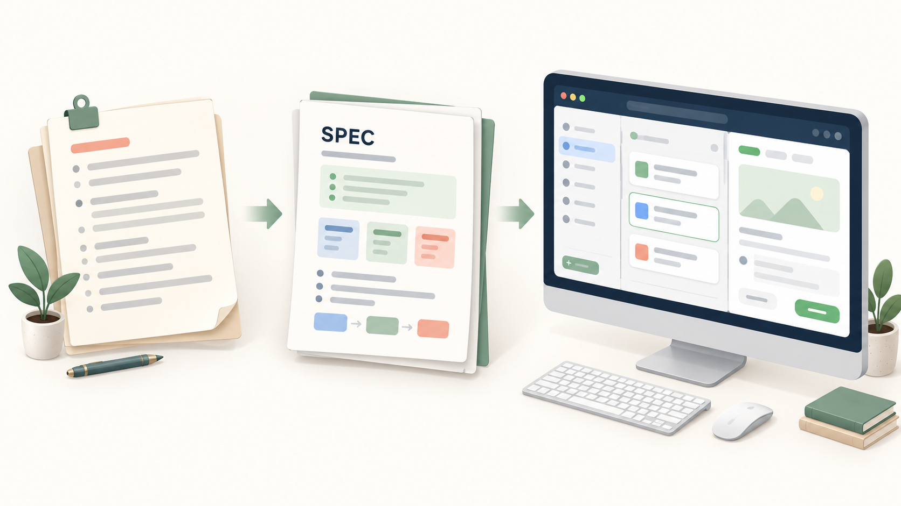
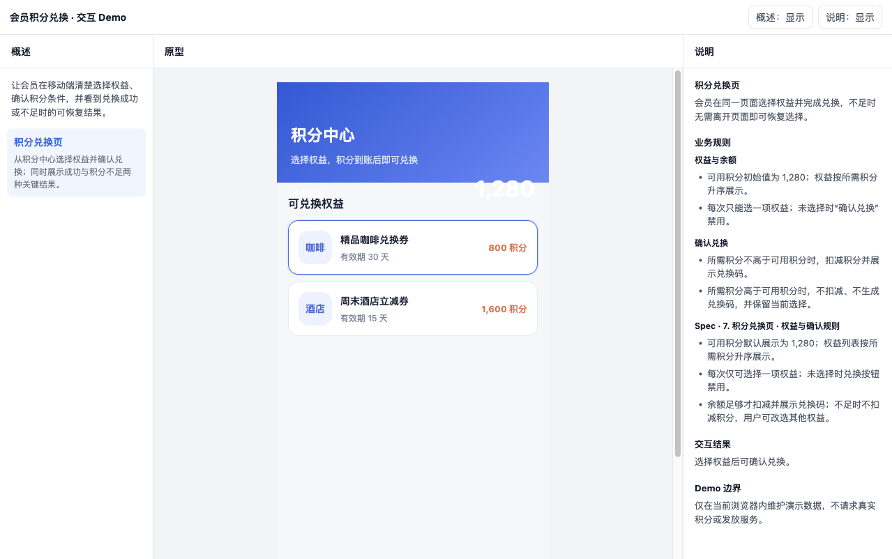
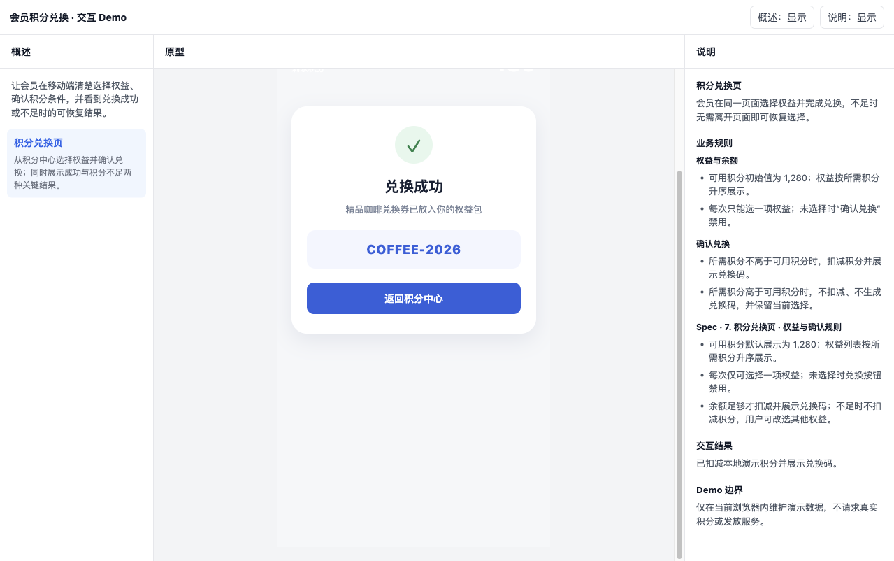

# Product Spec & Demo Assistant

一个面向产品经理的 Codex Skill：将已确认的产品需求整理为可开发验收的 SPEC，并生成可交互的单 HTML 三栏 Demo。Demo 左栏说明页面与目标，中栏演示产品页面，右栏写清字段、规则、状态、边界与结果。

它适合后台、中台、APP / H5 和微信小程序的产品方案沟通；不用于营销站点或品牌宣传页。



上图为概念示意：先收敛需求规则，再形成可开发验收的 SPEC，最后用三栏 Demo 将页面、交互状态与规则同步展示给研发和协作方。

## 效果示例

仓库附带了一个脱敏的 [会员积分兑换 SPEC](examples/membership-points/SPEC.md) 与对应的 [可交互 Demo](examples/membership-points/demo/index.html)。它覆盖选择权益、积分不足和兑换成功三种状态，并将 Spec 中的规则同步呈现在右栏。

| 选择权益 | 兑换成功 |
| --- | --- |
|  |  |

## 安装

需要 Node.js 20 或更高版本，以及已安装的 Codex 桌面应用或 Codex CLI。

```bash
git clone https://github.com/<your-account>/product-spec-demo-assistant.git ~/.codex/skills/product-demo
```

重启 Codex 或新建一个对话后，使用 `$product-demo` 调用该技能。若你的 Codex Skills 使用其他目录，请把仓库克隆到对应的 Skills 目录。

## 快速开始

在 Codex 对话中输入：

```text
使用 $product-demo：为会员积分兑换功能整理 SPEC，并制作一个商城后台 Demo。
```

技能会先澄清会改变范围、规则或验收标准的问题；在你确认摘要后，生成 SPEC 和对应的单 HTML Demo。

## 本地开发

```bash
npm test
npm run preview
node scripts/scaffold-demo.js <SPEC目录> --system mobile
node scripts/scaffold-demo.js <SPEC目录> --check-shell --spec <SPEC目录>/SPEC.md
```

`npm run preview` 会生成 `assets/shell-preview/index.html`，用于查看可复用外壳；该文件是本地生成物，不提交到仓库。

## 支持的系统外壳

| 标识 | 场景 |
| --- | --- |
| `mall-admin` | 商城后台 |
| `middle-platform` | 中台系统 |
| `mobile` | APP / H5 |
| `mini-program` | 微信小程序 |

## 项目结构

```text
SKILL.md                    技能行为与交付规则
assets/demo-template/       三栏 Demo 母版
assets/system-shells/       按终端或系统划分的可复用外壳
references/                 SPEC、评审与 Demo 规范
scripts/                    脚手架、校验与回归测试
```

## 隐私与贡献

请勿提交真实用户数据、凭据、内部截图或受限业务资料。贡献方式见 [CONTRIBUTING.md](CONTRIBUTING.md)；项目以 [MIT License](LICENSE) 发布。
